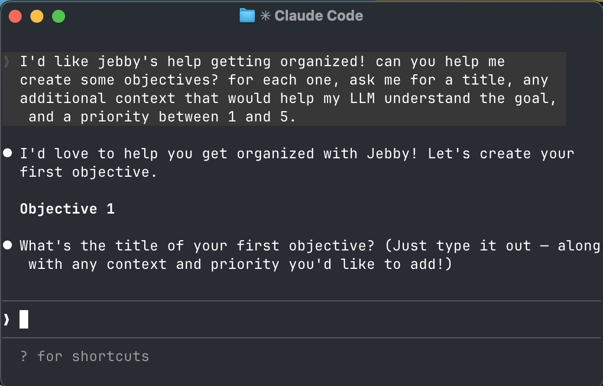
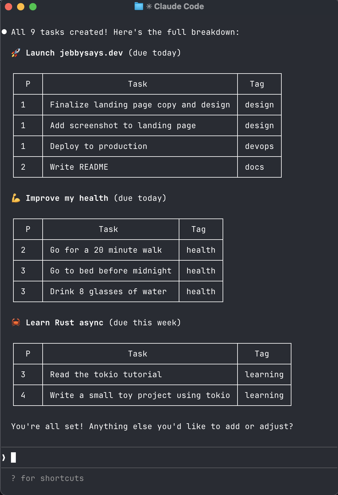
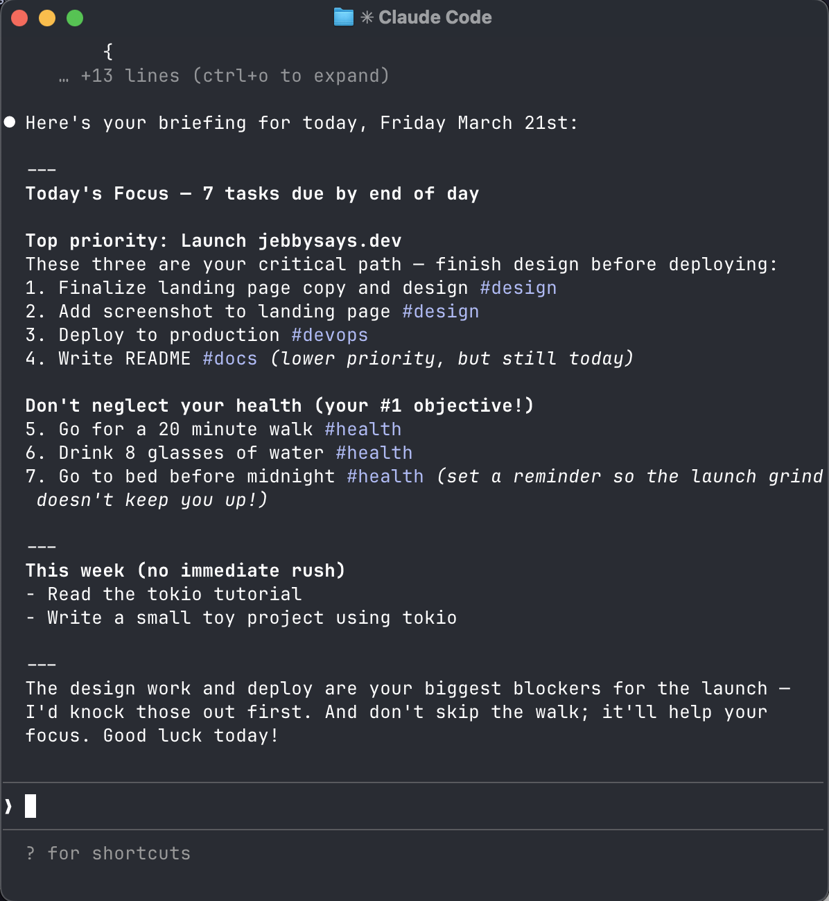

# 👉 **[jebbysays.dev](https://jebbysays.dev)** 👩🏻‍🏫

> when jebby says do a dance moves—you do a dance moves.

- Do you, like me, have crippling ADHD?
- Do you need an accountability buddy who won't let you off the hook?
- Do you struggle to keep track of your own todo list?

jebbysays keeps you on track. set goals, manage tasks, ask jebby what's next. because jebby says so, and that's enough.

Inspired by my own attempt at using Claude + Notion MCP as a personal assistant. It worked exceptionally well — until it didn't. The Notion MCP server [has some challenges](https://github.com/makenotion/notion-mcp-server/issues/47#issuecomment-3739384218).

## get started

The hosted version of `jebbysays` is free to use!

**1. connect via Claude Code**

```bash
claude mcp add jebbysays \
  --scope user \
  --transport http \
  https://jebbysays.dev/mcp
```

**2. authenticate**

Open Claude Code with `claude`, type `/mcp`, find jebby says, and hit authenticate.

---

### set up your goals



> jebby walking through your first objective

```
I'd like jebby's help getting organized! can you help me create some objectives?
for each one, ask me for a title, any additional context that would help my LLM
understand the goal, and a priority between 1 and 5.
```

### manage your tasks



> 9 tasks created across 3 objectives, just like that

```
can you help me break my objectives down into tasks? for each task, let's set a
deadline, priority, any relevant context, and tags if they make sense.
```

### check in with jebby



> your daily briefing, ready before your first coffee

```
can you ask jebby what I need to get done today? give me a briefing based on
my priorities and any upcoming deadlines.
```

---

## run locally

Prefer stdio? Jebby's got you.

```bash
# install
cargo install --git https://github.com/josiahparry/jebbysays

# run locally
jebbysays stdio
```

## self-host

Run your own instance. Jebby Says runs as an HTTP MCP server backed by a SQLite database.

You will need to set two environment variables to connect to your auth provider.

```bash
export MCP_SERVER_URL="http://localhost:24433"
export OAUTH_ISSUER="https://your-auth-provider"
```

Start the http server:

```bash
jebbysays serve
```

> [!IMPORTANT]
> When using http, you **must** have an authentication provider.
> Local via `stdio` doesn't use authentication.

Then connect your MCP client to your local instance:

```bash
claude mcp add jebbysays --scope user --transport http http://localhost:24433/mcp
```

## what it does

jebbysays gives your LLM a structured view of your work through two concepts:

**Objectives** — your goals, written in plain language. Give them a title, as much context as you want, and a priority from 1 to 5. Jebby will remember every word.

**Tasks** — the concrete work that moves your objectives forward. Tasks have priorities, deadlines, tags, and context, and belong to an objective.

Talk to jebby and ask for your daily briefing, run a weekly retro, or just ask "what should I focus on?" It will. get. done.

## resources

| URI | Description |
|---|---|
| `tasks://all` | All tasks |
| `tasks://incomplete` | Incomplete tasks |
| `tasks://completed` | Completed tasks |
| `objectives://all` | All objectives |
| `task://{id}` | A specific task |
| `objective://{id}` | A specific objective |

## tools

| Tool | Description |
|---|---|
| `add_task` | Create a new task |
| `modify_task` | Update fields on a task |
| `complete_task` | Mark a task as done |
| `delete_task` | Delete a task |
| `add_objective` | Create a new objective |
| `modify_objective` | Update an objective |
| `delete_objective` | Delete an objective |

## who's jebby?

Jebby is my wife's nickname. We both have crippling ADHD. But she has this superpower: she is unbelievably organized, detail-oriented, and when she sets her mind to something? It will get done!

So when jebby says "do a dance move"—you do a dance move. You will be better for it.

We also have two cats. **Juice** is a tuxedo cat with a red collar. **Beanie** (government name: Onion) is a tortie with one paw the color of peanut butter. They both supervised the building of this app and have strong opinions.
